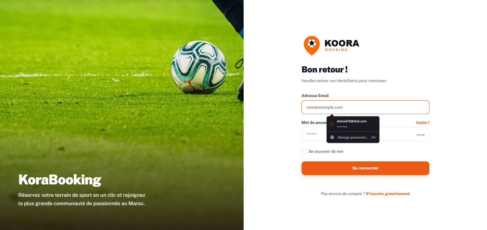
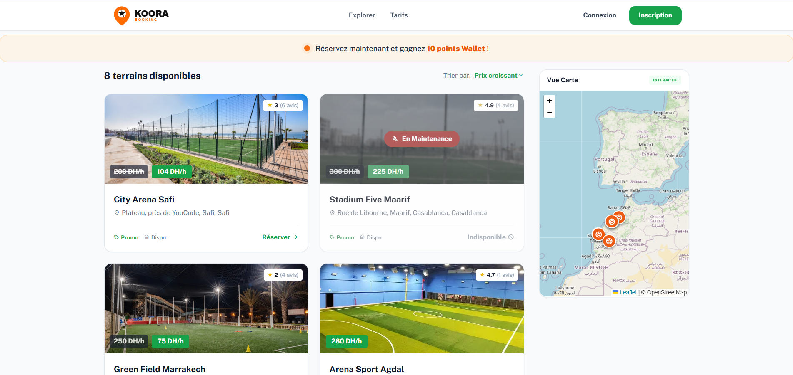
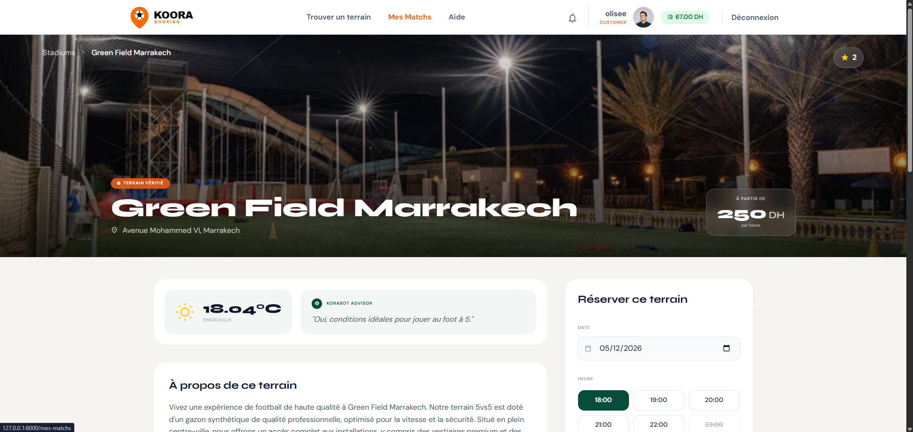
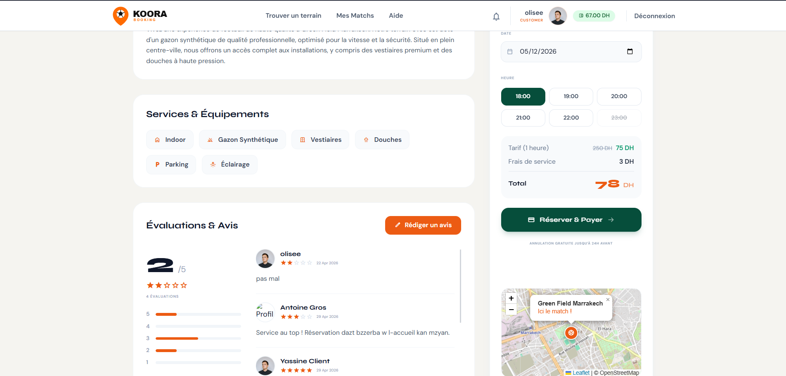
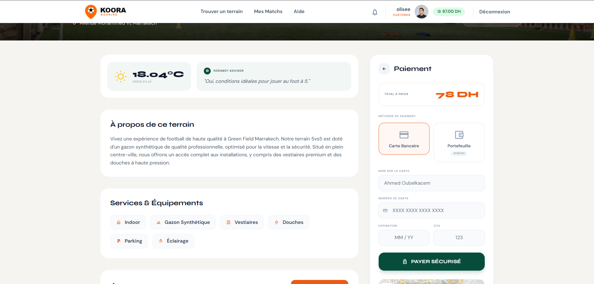
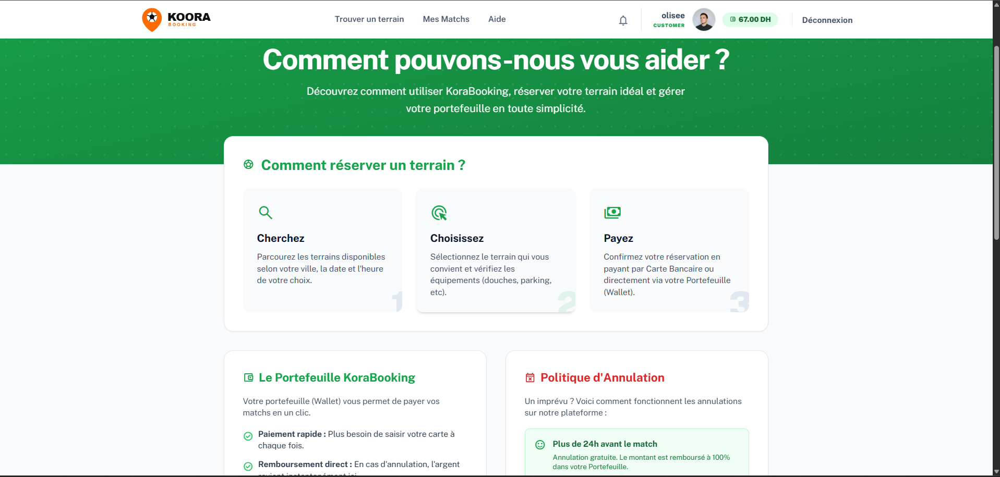
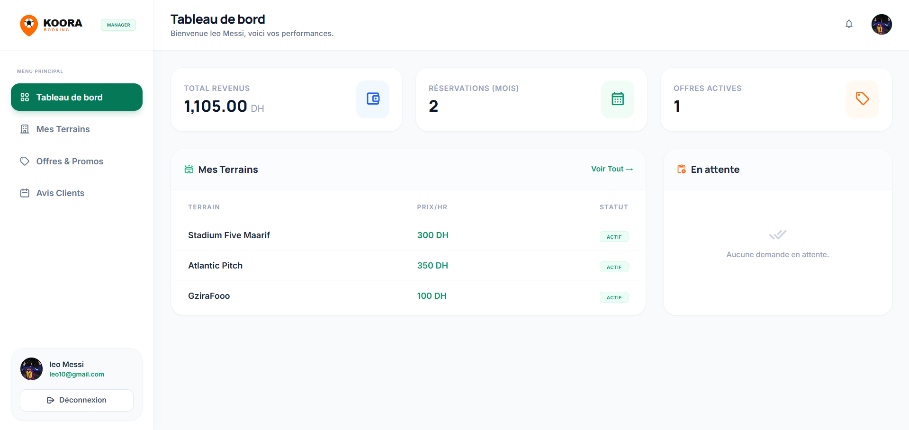
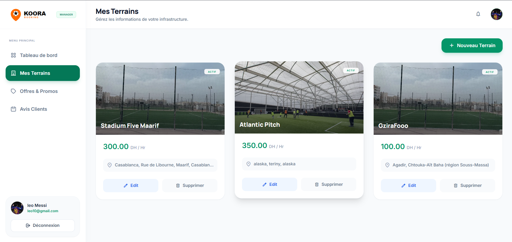
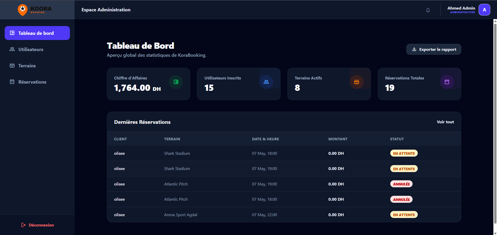
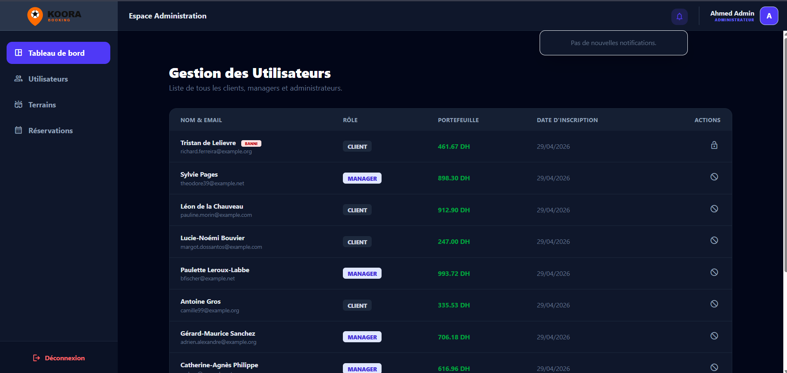

## 📸 Aperçu de l'Application

Voici quelques captures d'écran illustrant les différentes interfaces de KoraBooking :

### 🚪 Authentification

### 👤 Espace Client

**Exploration et Carte Interactive :**

**Détails du terrain & IA Météo (Korabot Advisor) :**

**Système d'évaluation et Réservation :**

**Paiement Sécurisé & Wallet :**

**Centre d'Aide :**

### 🏢 Espace Manager

**Tableau de Bord des Revenus :**

**Gestion des Infrastructures :**

### 🛡️ Espace Administration

**Statistiques Globales de la Plateforme :**

**Gestion des Rôles et Utilisateurs :**

